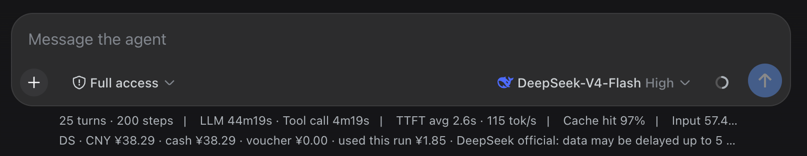

# dsh-balance-plugin

在 [DeepSeek Harness](https://github.com/lucaslus/deepseek-harness-desktop) 的 Web 客户端里，于输入框下方常驻显示当前模型服务商的账户余额读数。

- **DeepSeek**：总余额 / 充值余额 / 赠送余额 + 账户可用状态
- **Kimi（月之暗面）**：可用余额 / 现金 / 代金券（现金为负时标注 ⚠ 欠费）
- **Qwen（阿里云百炼）**：识别模式并提示 Token Plan 需在控制台查询（百炼 API Key 无余额查询接口）

读数行与产品自带的 stats 行（`tok/s · cache hit %`）同款字号、颜色、左对齐；行尾直接显示官方数据时效说明；中英文跟随界面语言自动切换。

## 效果预览



## 安装

### 一键安装（curl）

```sh
curl -fsSL https://raw.githubusercontent.com/lucaslus/dsh-balance-plugin/main/install.sh | bash
```

默认安装到 `web` profile；指定 profile：

```sh
DSH_PROFILE=web curl -fsSL https://raw.githubusercontent.com/lucaslus/dsh-balance-plugin/main/install.sh | bash
```

### 手动安装

```sh
dsh plugin --profile web add github:lucaslus/dsh-balance-plugin
```

## 安装后需要重启客户端

本插件包含浏览器端 UI（`dsh.client`），它在 `dsh` 进程启动时被扫描进浏览器插件表；Web 的 HMR 目前处于禁用状态。因此**安装完成后需要重启客户端**才会加载读数行：

```sh
dsh --profile web
```

## 配置

插件自动从当前模型路由识别服务商，并沿用各模型适配器自己的凭据配置，无需重复填写：

| 平台 | API key 环境变量（默认） |
|---|---|
| DeepSeek | `DEEPSEEK_API_KEY` |
| Kimi | `KIMI_API_KEY`（或 `MOONSHOT_API_KEY`） |
| Qwen | `DASHSCOPE_API_KEY` |

如果你在设置里给模型配置了自定义的 `apiKeyEnv` 或 `baseURL`，插件会跟随该配置读取。

## 数据时效（官方口径）

| 平台 | 官方延迟 |
|---|---|
| DeepSeek | 数据最多延迟 5 分钟（GMT+8） |
| Kimi | 可用余额、今日消费及总消费约延迟 10 分钟 |

读数行行尾直接显示对应说明。插件每 5 秒拉取一次余额接口，但余额数值本身受上表官方延迟约束，因此短时间内数值不变化是正常的。

## 搭配使用

本插件是 DeepSeek Harness 的扩展，请搭配客户端使用：

- DeepSeek Harness 客户端：<https://github.com/lucaslus/deepseek-harness-desktop>

## 已知限制

- **Qwen / 百炼 Token Plan**：百炼没有可用的 API-key 余额接口（官方查询需控制台登录），插件只做模式识别与提示。
- **"运行期已耗"**：DeepSeek / Kimi 余额接口只返回剩余额度，不返回历史消耗；插件以本次启动后首次读到的余额为基线，差值即为运行期消耗，重启后重新计基线。
- 余额查询依赖本机 `curl`（macOS / Linux 自带）。

## 开发

- `index.js` — node 半：注册 `/dsh-balance` HTTP 路由，查询余额并返回 JSON；`FAMILIES` 数组是扩展点，新增平台只需追加一项。
- `client.js` — 浏览器半：手写的 `window.__ModuleLoader__.load` 客户端 bundle，渲染 `conversation.composer.dock` 读数行。
- `cordis.patch.yml` — bundle patch 层，插入插件行。

## License

MIT
